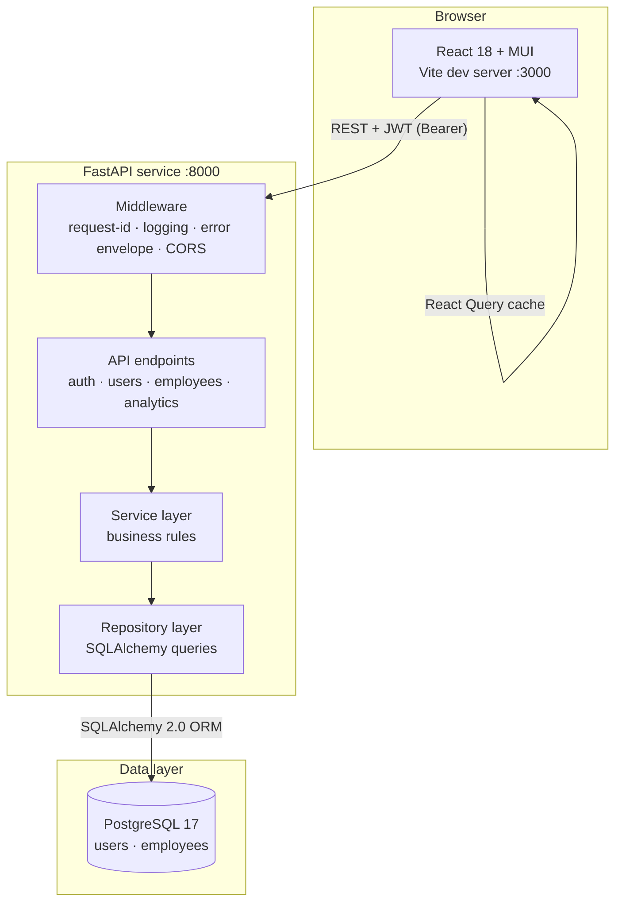
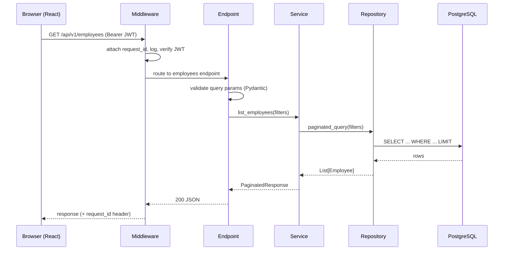
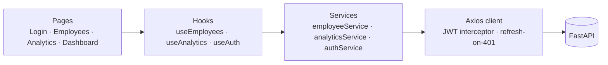
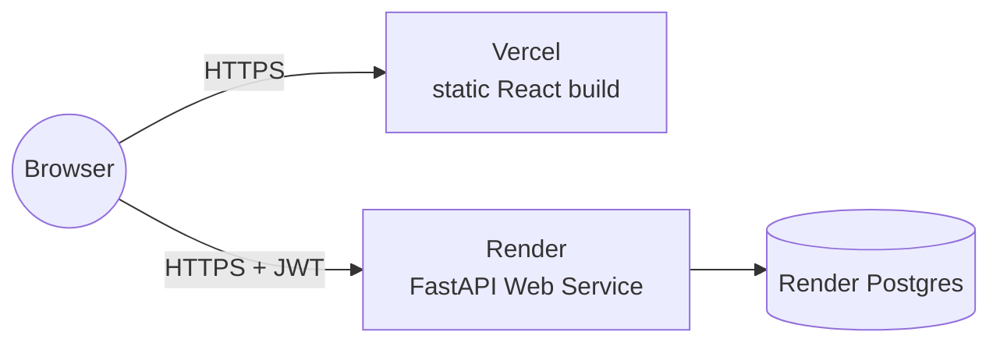

# Architecture

## High-level overview



## Request lifecycle



## Layer responsibilities

| Layer | Owns | Doesn't own |
|---|---|---|
| **API / endpoint** | HTTP framing, request validation, status codes | Business rules, SQL |
| **Service** | Business rules, cross-repo orchestration, domain errors | HTTP shapes, SQL |
| **Repository** | SQL, query composition, returning ORM/domain objects | Business decisions, HTTP |
| **Model** | DB schema, constraints, indexes | Behavior — keep them dumb |
| **Schema (Pydantic)** | Request/response shapes, validation rules | DB shape — kept separate from models |

This separation lets us swap one layer without rewriting others — e.g., adding a CLI or a GraphQL layer reuses the same service + repository.

## Low-level call paths

```
AuthController       (auth.py)
    └─> AuthService             ─> UserRepository
EmployeeController   (employees.py)
    └─> EmployeeService         ─> EmployeeRepository
AnalyticsController  (analytics.py)
    └─> AnalyticsService        ─> AnalyticsRepository
```

## Frontend layers



- **Pages** render UI and consume hooks.
- **Hooks** wrap React Query (cache + invalidation) over service calls.
- **Services** are thin wrappers around the Axios client — easy to mock in tests.
- **API client** owns auth (token attach + refresh on 401) and error normalization.

## Security boundaries

- **JWT verification** — happens in middleware before any handler sees the request. Unauthenticated requests are rejected before business logic runs.
- **Password hashing** — bcrypt via Passlib. Plaintext passwords are never logged.
- **Role-based access control** — `admin` role required for write endpoints and the user-provisioning route. Non-admin tokens are also rejected client-side after login (defense-in-depth).
- **CORS** — explicit allow-list via `CORS_ORIGINS` env var; no wildcards in production.
- **SQL injection** — every query goes through SQLAlchemy parameterized binding; no string concatenation of user input into SQL.
- **Validation** — Pydantic validates every request body and query param before business logic.
- **Defense in depth** — DB-level `CHECK (salary > 0)` constraint backs up the API-level Pydantic validation.

## Scalability path

Current state is single-instance ready. Listed in order of when you'd need each:

1. **Vertical scaling** — bigger DB instance. Free first lever.
2. **Connection pooling** — already enabled (`pool_size=5`, `max_overflow=10`, `pool_pre_ping`).
3. **Read replicas** — if read traffic outgrows a single Postgres node.
4. **Redis caching** — dashboard endpoints first (they're idempotent and hot).
5. **Materialized views** — for group-by-country analytics if the employee table grows past ~100k.
6. **Horizontal backend scaling** — JWT is stateless, so adding more uvicorn workers/instances is mechanical.
7. **CDN for frontend** — already free on Vercel.

## Deployment target



- **Frontend → Vercel** — Vite build, automatic deploys per push to `main`.
- **Backend → Render** — Python Web Service, build `pip install -r requirements.txt`, start `uvicorn app.main:app --host 0.0.0.0 --port $PORT`.
- **Database → Render Postgres** — Internal URL injected as `DATABASE_URL`.
- **Secrets → Render env vars** — `SECRET_KEY`, `CORS_ORIGINS` (Vercel URL), admin bootstrap creds.

See [setup.md](setup.md) for local setup and the deployment preview section.
